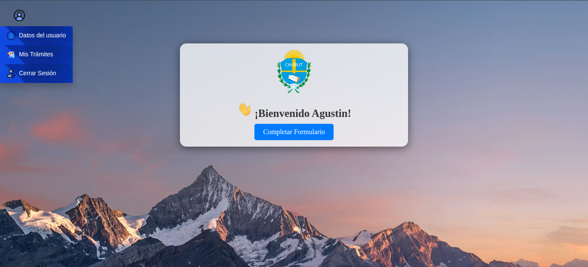

# VeSEP


<div>


<br>
<br>


<br>


<br>
</div>
<br>

## Índice
- [Introducción](#introducción)
- [Elementos](#elementos)
- [Instalación](#instalación)
- [Despedida](#despedida)

# Introducción 
<p align="justify">
El objetivo es desarrollar un sistema que permita la autenticacion de usuarios para poder acceder a un formulario de carga.

El desarrollo de este sistema otorga a los usuarios finales cargar su trámite y poder verlo en el sistema y editarlo.
</p>

## Elementos
- Python 3.10.12
- Django versión 4.2.14

##### Página para descargar Python:

<a> https://www.python.org/downloads/ </a>

## Instalación
```bash
#Clonar el repositorio:
git clone https://github.com/aguspacheco/RegisterUser.git

#Crear el entorno virtual:
python3 -m venv <venv>

#Activar el entorno virtual en windows:
source <venv>/Scripts/activate

#Activar el entorno virtual en linux:
source <venv>\Scripts\activate

#Acceder al proyecto
cd VeSEP/

#Realizar las migraciones
python manage.py makemigrations
python manage.py migrate

#Crear un superusuario
python manage.py createsuperuser

#Ejecutar el proyecto
python manage.py runserver

```
# Despedida
Gracias por utilizar el sistema de registro y carga de datos!!!.
</div>
